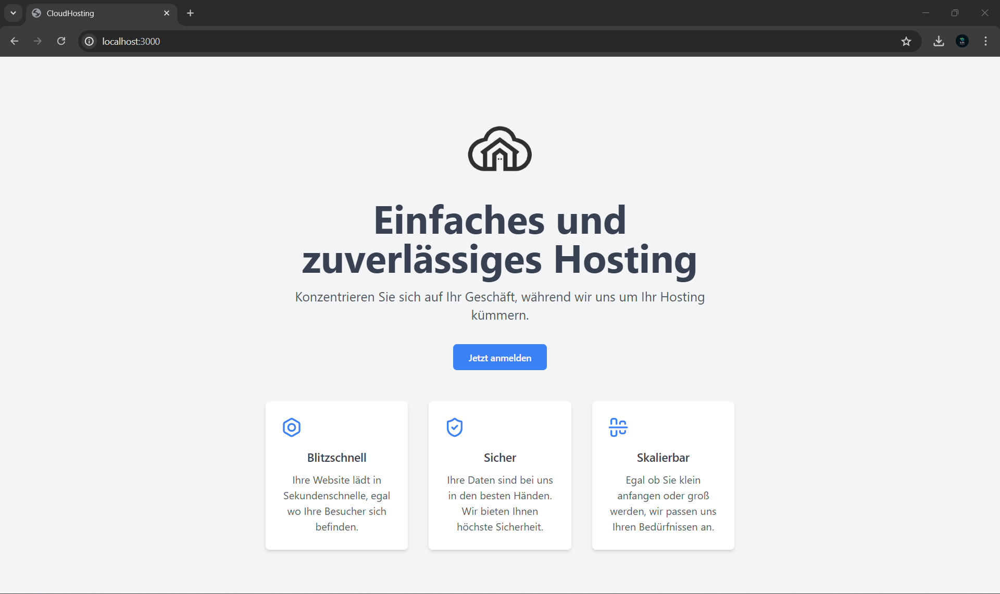
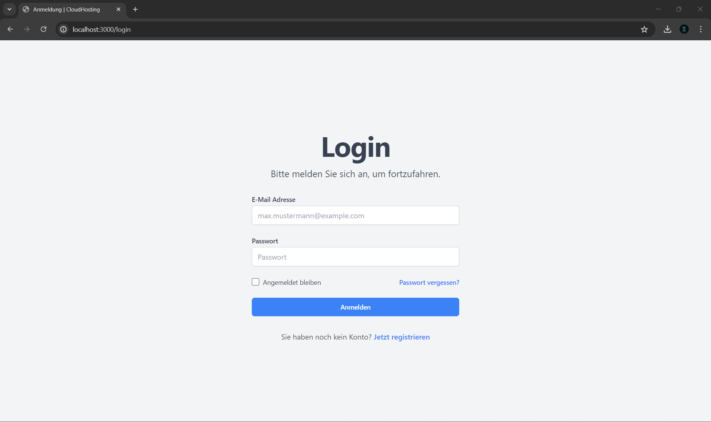
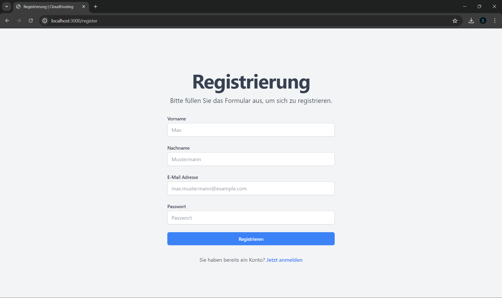
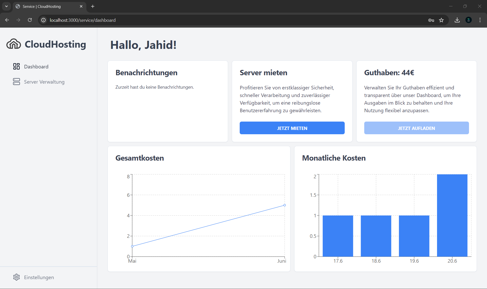
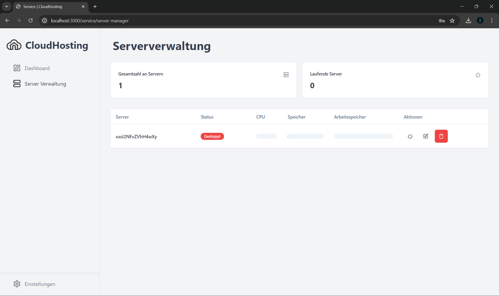
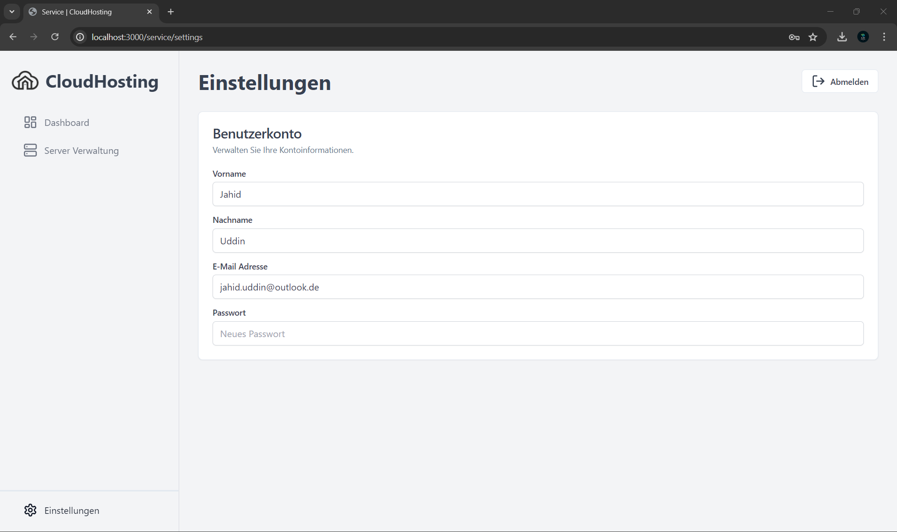

# Cloud Hosting

Diese Web-App namens "CloudHosting" ermöglicht die Verwaltung von Cloud-Servern. Benutzer können sich authentifizieren und erhalten personalisierte Informationen. Die App bietet Funktionen wie das Mieten neuer Server, das Verwalten bestehender Server, und das Aufladen von Guthaben. Statistiken zu Gesamt- und monatlichen Kosten werden übersichtlich dargestellt. Außerdem können Benutzer ihre Kontoinformationen anpassen.

## Übersicht

